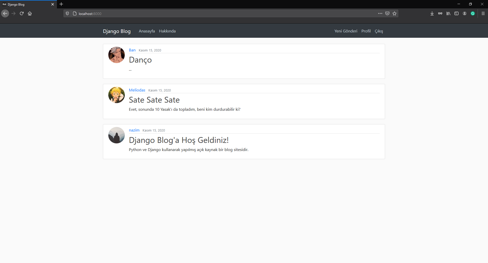

# Django Blog Uygulaması



Python Django ile yaptığım küçük çaplı bir blog uygulaması. Basit, kolay ve hızlı...

## Bu bloğun özellikleri:
- Giriş/Kayıt
- Gönderi paylaşma
- Gönderi silme
- Gönderi düzenleme
- Profil düzenlemesi
- Şifremi unuttum (mail adresi gerekli)

## Kurulum ve sunucuyu çalıştırma

#### Öncelikle bir sanal ortam oluşturmakla başlayalım
```bash
python3 -m pip install virtualenv
python3 -m virtualenv venv
```

#### Sanal ortamı çalıştır
`Windows`
```bash
venv\Scripts\activate
```
`Linux` ve `macOS`
```
source venv/bin/activate
```

#### Son olarak kütüphaneleri yükle
```bash
python3 -m pip install -r requirements.txt
```


## Blog ugulamasını yerel olarak çalıştırma
```bash
python3 manage.py runserver
```

Ve son olarak favori tarayıcınızın URL adresine bunu yazarak uygulayamayı çalıştırın ve gönderi paylaşmaya hazırsınız!
```
http://127.0.0.1:8000/
```

## Şifremi unuttum için mail adresi
Kök dizinde bulunan `email_user.txt` dosyasına içinde belirtildiği gibi bir `gmail` adresi ve `şifresi` girilmeli. Neden özellikle gmail? Çünkü bu proje mail sunucusu olarak `smtp.gmail.com` kullanıyor.

`api/settings.py`
```python
EMAIL_BACKEND = 'django.core.mail.backends.smtp.EmailBackend'
EMAIL_HOST = 'smtp.gmail.com'
EMAIL_PORT = 587
EMAIL_USE_TLS = True

with open(file='email_user.txt', mode='r', encoding='utf-8') as file:
    EMAIL_HOST_USER = file.readline()
    EMAIL_HOST_PASSWORD = file.readline()
```
